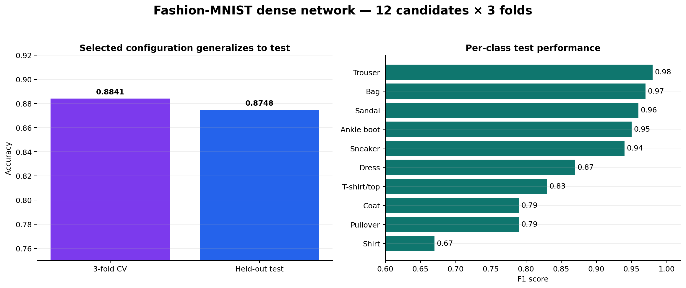

# Fashion-MNIST Grid Search

A GPU-assisted hyperparameter search for a dense TensorFlow classifier on the official Fashion-MNIST split. The project evaluates **12 configurations × 3 folds = 36 fits**, keeps the 10,000-image test set untouched during selection, and documents how human judgment narrowed an LLM-suggested search space.



## Captured Colab T4 result

| Metric | Result |
|---|---:|
| Best batch size | 32 |
| Best hidden width | 128 neurons |
| Best optimizer | Adam |
| Mean 3-fold validation accuracy | **0.8841** |
| Held-out test accuracy | **0.8748** |
| Complete search time | 929.09 seconds |

The most difficult class was `Shirt` (F1 0.67), while `Trouser`, `Bag`, `Sandal`, and both footwear classes were classified substantially more reliably.

## What is included

- Executed notebook with all 36 fit logs, classification report, heatmap, and confusion matrix
- Reusable TensorFlow/SciKeras experiment module with deterministic seeds
- Captured run and class-level metrics in CSV
- A transparent note explaining which LLM suggestions were accepted or rejected
- Tests that verify the search contract and completed notebook conclusions

## Run

The complete search is designed for Python 3.10–3.12 and benefits from a CUDA-capable TensorFlow runtime:

```bash
python -m pip install -e ".[dev]"
python -m fashion_gridsearch.experiment
pytest
```

The Fashion-MNIST loader downloads the official 60,000 training and 10,000 test images automatically. GPU availability changes runtime, not the experiment definition.

## Data source

Fashion-MNIST was created by Zalando Research as a drop-in image-classification benchmark: 70,000 grayscale 28×28 images across 10 balanced classes, with the official 60,000/10,000 split. The source dataset is MIT-licensed and is not duplicated in this repository.

## Author

Aaron Fernandez Pinto — Data Science student at Universidad Autónoma de Baja California (UABC).

---

<details>
<summary><b>Español</b></summary>

<br>

# Búsqueda en cuadrícula con Fashion-MNIST

Una búsqueda de hiperparámetros asistida por GPU para un clasificador denso de TensorFlow sobre la división oficial de Fashion-MNIST. El proyecto evalúa **12 configuraciones × 3 folds = 36 ajustes**, mantiene intacto el conjunto de prueba de 10,000 imágenes durante la selección y documenta cómo el criterio humano acotó un espacio de búsqueda sugerido por un LLM.


## Resultado capturado en Colab T4

| Métrica | Resultado |
|---|---:|
| Mejor tamaño de batch | 32 |
| Mejor ancho de capa oculta | 128 neuronas |
| Mejor optimizador | Adam |
| Accuracy media de validación con 3 folds | **0.8841** |
| Accuracy del conjunto de prueba apartado | **0.8748** |
| Tiempo completo de búsqueda | 929.09 segundos |

La clase más difícil fue `Shirt` (F1 0.67), mientras que `Trouser`, `Bag`, `Sandal` y ambas clases de calzado se clasificaron con una confiabilidad sustancialmente mayor.

## Qué se incluye

- Notebook ejecutado con los 36 registros de ajustes, reporte de clasificación, mapa de calor y matriz de confusión
- Módulo reutilizable de experimento TensorFlow/SciKeras con semillas deterministas
- Métricas capturadas de la ejecución y por clase en CSV
- Una nota transparente que explica qué sugerencias del LLM se aceptaron o rechazaron
- Pruebas que verifican el contrato de búsqueda y las conclusiones del notebook terminado

## Ejecución

La búsqueda completa está diseñada para Python 3.10–3.12 y se beneficia de un entorno TensorFlow compatible con CUDA:

```bash
python -m pip install -e ".[dev]"
python -m fashion_gridsearch.experiment
pytest
```

El cargador de Fashion-MNIST descarga automáticamente las 60,000 imágenes oficiales de entrenamiento y las 10,000 de prueba. La disponibilidad de GPU cambia el tiempo de ejecución, no la definición del experimento.

## Fuente de datos

Fashion-MNIST fue creado por Zalando Research como benchmark intercambiable de clasificación de imágenes: 70,000 imágenes en escala de grises de 28×28 distribuidas en 10 clases balanceadas, con la división oficial 60,000/10,000. El conjunto fuente tiene licencia MIT y no se duplica en este repositorio.

## Autor

Aaron Fernandez Pinto — estudiante de Ciencia de Datos en la Universidad Autónoma de Baja California (UABC).

</details>
